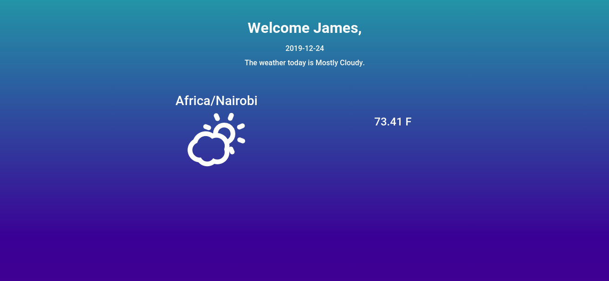

# WEATHER APP

### Author

**James Ngari N.**

#### Version v1.0

Click on this [link](https://jay-68.github.io/weatherApp/) to view the application.

## Description

This is a basic application created with html, css and javascript.

## Setup Information
`
    git clone https://github.com/Jay-68/weatherApp
    //Open the file index.html to access the website.
`

## Features

* After the webpage loads, 

## Technologies Used

**HTML5** - For the websites basic markup and positioning of the page's content.

**CSS** - For the basic styling of the web page.

**Bootstrap** - For the responsiveness of the webpage at different screen widths.

**Javascript** - For the functionality of the webpage.

## License

MIT - <https://opensource.org/licenses/MIT> 

&copy; James Ngari N.
